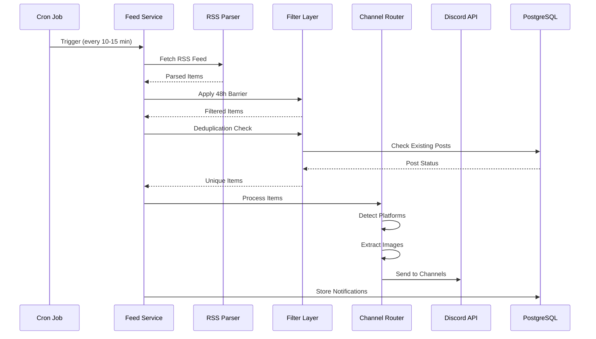
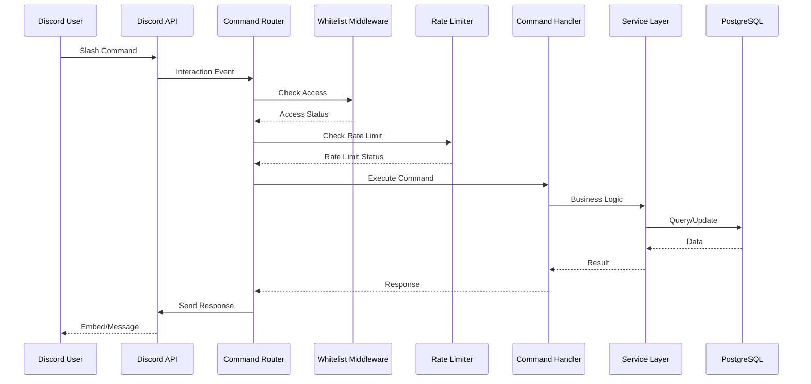
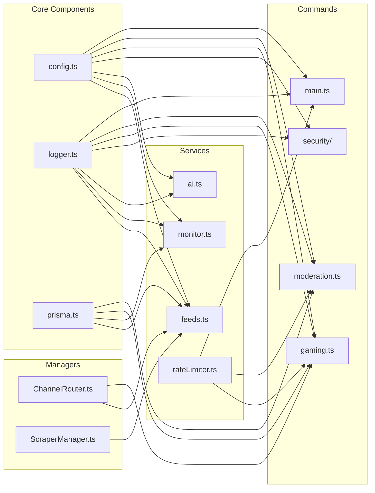
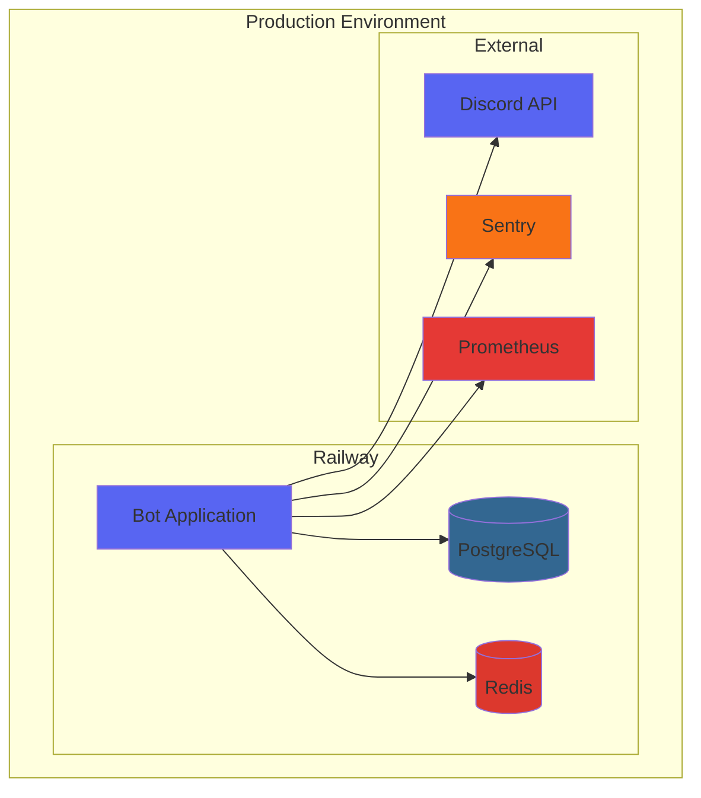
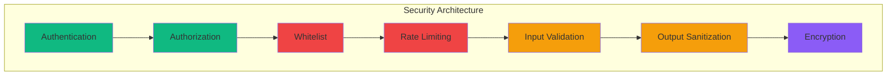

# Architecture Diagram

## System Architecture Overview

```mermaid
graph TB
    subgraph "External Services"
        DISCORD[Discord API]
        OPENROUTER[OpenRouter AI]
        RAWG[RAWG.io API]
        STEAM[Steam API]
        TWITTER[Twitter/X API]
        YOUTUBE[YouTube API]
    end

    subgraph "Discord Surveillance Bot"
        subgraph "Discord.js Layer"
            CLIENT[Discord.js Client]
            EVENTS[Event Handlers]
            COMMANDS[Command Router]
            RATELIMIT[Rate Limiter]
        end

        subgraph "Application Layer"
            subgraph "Commands"
                MOD[Moderation]
                GAMING[Gaming]
                SECURITY[Security]
                ADMIN[Admin]
            end

            subgraph "Services"
                AI[AI Service]
                MONITOR[Monitor Service]
                FEEDS[Feeds Service]
                HEALTH[Health Service]
                METRICS[Metrics Service]
            end

            subgraph "Managers"
                ROUTER[Channel Router]
                SCRAPER[Scraper Manager]
                ALERT[Alert Manager]
            end

            subgraph "Cron Jobs"
                DEALS[Deals Cron]
                FREE[Free Games Cron]
                STEAM_NEWS[Steam News Cron]
                TWITTER_CRON[Twitter Cron]
            end

            subgraph "Middleware"
                WHITELIST[Whitelist]
                LOGGING[Logging]
            end
        end

        subgraph "Data Layer"
            POSTGRES[(PostgreSQL)]
            REDIS[(Redis Cache)]
        end

        subgraph "Monitoring"
            WINSTON[Winston Logger]
            PROMETHEUS[Prometheus Metrics]
            SENTRY[Sentry Error Tracking]
            HEALTHCHECK[Health Check Endpoints]
        end
    end

    DISCORD --> CLIENT
    CLIENT --> EVENTS
    CLIENT --> COMMANDS
    COMMANDS --> RATELIMIT
    RATELIMIT --> WHITELIST
    
    COMMANDS --> MOD
    COMMANDS --> GAMING
    COMMANDS --> SECURITY
    COMMANDS --> ADMIN

    EVENTS --> MONITOR
    EVENTS --> ALERT

    MOD --> POSTGRES
    SECURITY --> POSTGRES
    GAMING --> ROUTER

    AI --> OPENROUTER
    MONITOR --> POSTGRES
    FEEDS --> ROUTER
    FEEDS --> SCRAPER

    ROUTER --> CLIENT
    SCRAPER --> RAWG
    SCRAPER --> STEAM

    DEALS --> FEEDS
    FREE --> FEEDS
    STEAM_NEWS --> FEEDS
    TWITTER_CRON --> FEEDS

    FEEDS --> TWITTER
    FEEDS --> YOUTUBE

    POSTGRES --> HEALTH
    REDIS --> RATELIMIT
    REDIS --> FEEDS

    HEALTH --> HEALTHCHECK
    METRICS --> PROMETHEUS
    WINSTON --> SENTRY

    style DISCORD fill:#5865F2
    style CLIENT fill:#5865F2
    style POSTGRES fill:#336791
    style REDIS fill:#DC382D
    style OPENROUTER fill:#10B981
    style RAWG fill:#F59E0B
    style STEAM fill:#1B2838
```



## Data Flow: RSS Feed Processing



## Data Flow: Command Execution



## Component Relationships



## Deployment Architecture



## Security Layers



## Monitoring Stack

```mermaid
graph LR
    subgraph "Application"
        APP[Bot Application]
    end

    subgraph "Logging"
        WINSTON[Winston]
        LOGS[Log Files]
    end

    subgraph "Metrics"
        PROM_CLIENT[prom-client]
        METRICS_ENDPOINT[/metrics]
    end

    subgraph "Health Checks"
        HEALTH_SERVER[Health Server]
        HEALTH_ENDPOINT[/health]
    end

    subgraph "Error Tracking"
        SENTRY[Sentry]
    end

    APP --> WINSTON
    WINSTON --> LOGS
    WINSTON --> SENTRY

    APP --> PROM_CLIENT
    PROM_CLIENT --> METRICS_ENDPOINT

    APP --> HEALTH_SERVER
    HEALTH_SERVER --> HEALTH_ENDPOINT

    style APP fill:#5865F2
    style WINSTON fill:#6366F1
    style PROM_CLIENT fill:#E53935
    style HEALTH_SERVER fill:#10B981
    style SENTRY fill:#F97316
```
